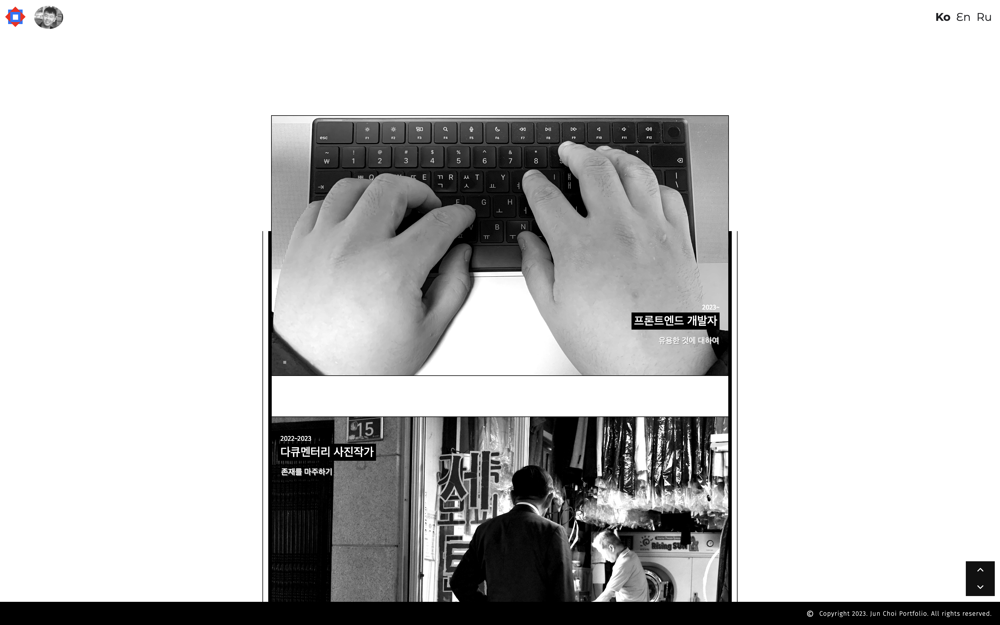

# 준의 포트폴리오

개발자라는 직업에 닿기까지의 여정을 담은 포트폴리오 입니다. 개발자 프로젝트에 대한 내용 뿐만 아니라, 이전에 가졌던 두 직업(다큐멘터리 포토그래퍼와 인형극 연출가)에 대한 정보, 그리고 당시 아카이빙 되었던 사진들도 함께 보실 수 있습니다. 



## 배포 링크 

https://jun-portfolio-two.vercel.app

## 디자인을 하면서 중요하게 여긴 부분

에밀 루더의 저서 타이포그래피를 보면 이런 문구가 나옵니다.

```
"타이포그래피는 글로 정보를 전달할 분명한 의무가 있다.
다른 어떤 논쟁이나 생각도 타이포그래피를 이 의무로부터 떼어놓을 수 없다.
읽을 수 없는 인쇄물은 의미가 없다." 
```

이 글은 제 디자인 작업에 많은 영향을 주었습니다. 그 자신의 형태적 아름다움을 강조하는 폰트의 사용은 지양하고, 가독성에 초점을 맞추었습니다. 

또한 화려한 인터랙션이나 독창적인 그리드 구조보다는 구조의 단순함에 집중했으며, 그와 동시에 콘텐츠의 질을 높이는데 주력했습니다. 액자가 별로지만 그림이 괜찮다면 사람들은 불평을 하더라도 잠시나마 시간을 투자하겠지만, 액자만 예쁘고 그림이 별로라면 바로 그 자리를 떠날 것이기 때문입니다. 

## 개발을 하면서 중요하게 여긴 부분


### 웹 성능을 위한 이미지 최적화

고화질의 이미지 소스가 많이 사용 되었는데, 이로 인해 초기 렌더링시 치명적인 속도 지연 문제가 있었습니다.

품질은 유지하며, 용량은 줄이는 방법을 찾아야 했고, 다음과 같은 방법을 사용했습니다.

1. 이미지 파일을 열어 적절한 사이즈(큰 화면에서 이미지를 보더라도 깨짐이 발생하지 않을 정도)로 줄인 상태에서 캡쳐하여 1차적으로 용량을 줄임. 용량은 tinypng 에서 무료 서비스가 허용되는 "5MB" 아래로. 

2. https://tinypng.com/ 를 활용하여 전체 이미지를 압축하여 2차적으로 용량을 줄임.

위와 같은 과정을 통해 체감상 50 ~ 70% 정도 페이지 렌더링 속도가 빨라진 것을 확인할 수 있었습니다.

(최적화 이후 알게 된 사실 : 크롬 개발자 도구를 통해 웹 렌더링 속도를 정확히 측정할 수 있다. 다음에도 비슷한 최적화 과정을 거칠 경우, 꼭 개발자 도구를 통해 정확한 수치를 확인해야겠다.)  


### 다국어

사이트는 3개 국가의 유저들을 대상으로 제작되었습니다. 그렇기에 언어 기능이 편리하고 유연하게 작동하도록 하는 것이 중요했는데요. 아래는 개발을 진행 하면서 고려하였던 부분들입니다. 

1. 언어는 전역으로 변경 되어야 하며, 라우터 전환 시에도 그 값이 유지 되어야 한다. 어떻게 구현 할 것인가?

2. 언어가 변경되면 그 국가에 해당하는 데이터를 출력해야 한다. 데이터는 어떻게 보관하고 어떻게 출력 할 것인가?

3. 기본 언어 값은 한국어로 설정되어 있다. 그러나 사용자가 영미권, 러시아권, 또는 그 이외의 국가 사람이라면 어떻게 할 것인가?


1번에 대한 해답은 Redux를 사용한 상태 관리였습니다. 이를 통해 전역 언어 상태를 유지하고, 사용자가 원하는 언어로 손쉽게 전환할 수 있었습니다.

2번에 대한 해답은 JSON 파일을 사용해 각 국가의 데이터를 저장하고, map 메소드를 활용해 해당 데이터를 출력하는 방식이었습니다. 이를 통해 효율적으로 다양한 데이터를 관리하고 사용자에게 보여줄 수 있었습니다.

3번에 대한 해답은 ip를 사용하여 사용자의 위치를 파악하고, 해당 국가의 언어를 기본값으로 설정하는 것이었습니다. ip2location API를 활용하여 개발 진행 중에 있습니다.


## 앞으로 개발을 계속 진행하면서

개선되어야 할 부분들에 대해 생각 중입니다. 포트폴리오에서 블로그 형식의 사이트로 발전시키고 싶습니다. 사이트 자체에 CRUD와 사진 편집 기능, 레이아웃 설정 기능을 넣으면, 추후에 훨씬 편할 것 같습니다. Firebase나 MongoDB와 같은 NoSQL을 활용하여 개발해보겠습니다.

